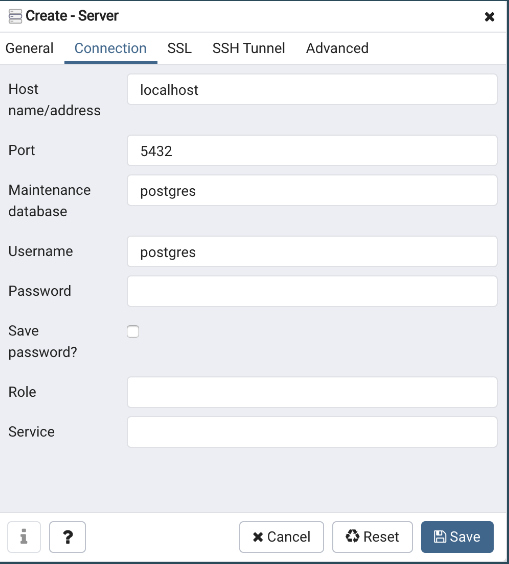
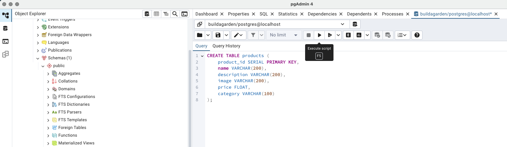
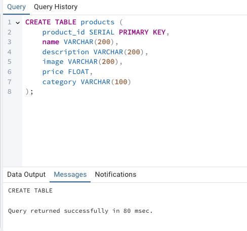

## Database Setup Instructions

### I. Install Postgres 17 following the instructions here https://www.enterprisedb.com/postgres-tutorials/installation-postgresql-mac-os

**Important: Make sure to take note of the password you set for the _postgres_ superuser as you will use this later on to connect to the server**

### II. Connect to the server using pgAdmin

1. Open the pgAdmin application
2. Navigate to the "Object Explorer" on the left-hand pane. Right click on the 'Servers' and choose Register -> Server
   
3. A dialog will open. Set the following options on the 'General' tab of the dialog
   
4. Navigate to the 'Connection' tab of the dialog and input the necessary information
   

   Note: For password, input the password you set during installation

5. Once you have filled in the required details, you can click Save, and it will add the name to the list of the servers on the left-hand pane and connect to the server:
   

### III. Create a new "buildagarden" database

1. Navigate to the "Object Explorer" on the left-hand pane. Right click on the 'localhost' server and choose Create -> Database...
   
2. A dialog will open, set the name of the database as "buildagarden" and leave all other options as is
   
3. Click 'Save' on the dialog and confirm that the database was created successfully. It should appear on the left-hand pane under 'Databases' in 'localhost' server
   

### IV. Create Items table and insert data

1. Navigate to the _buildagarden_ database on the left-hand pane. Right click and choose 'Query Tool'.
   
2. Once the query tool opens, copy and paste the following SQL code to create the `items` table:

```sql
CREATE TABLE items (
    item_id SERIAL PRIMARY KEY,
    name VARCHAR(200),
    description VARCHAR(200),
    image VARCHAR(200),
    price FLOAT
);
```

After pasting the code, click on the "Execute Script" button to run the query.

It should look like this in the query tool:


If successful, you should see a message indicating that the command was executed successfully.



3. Now, copy and paste the following SQL code to insert data into the `items` table:

```sql
INSERT INTO items (name, description, image, price) VALUES
('Sunflower', 'Sunflowers are known for their large, bright yellow petals and tall stems. They symbolize loyalty and adoration.', 'https://upload.wikimedia.org/wikipedia/commons/4/40/Sunflower_sky_backdrop.jpg', 2.99),
('Rose', 'Roses are classic flowers that come in various colors, each symbolizing different emotions—red for love and passion, white for purity, and yellow for friendship.', 'https://img.freepik.com/free-photo/closeup-shot-red-rose-with-dew-top-black_181624-28079.jpg?semt=ais_items_boosted&w=740', 3.49),
('Lily', 'Lilies are elegant flowers often associated with purity and refined beauty. They come in various types, including Easter lilies and tiger lilies.', 'https://www.dutchgrown.com/cdn/shop/products/LilyStarGazer.jpg?v=1668676765', 4.99),
('Lavender', 'Lavender is renowned for its calming fragrance and purple flowers. It symbolizes tranquility and grace.', 'https://fairweathers.co.uk/wp-content/uploads/2015/02/a.-Havana-RL0746-scaled.jpg', 1.99),
('Gumamela', 'Gumamela, commonly known as hibiscus, features large, colorful blooms that thrive in tropical climates. They often symbolize delicate beauty and fragility.', 'https://i.pinimg.com/736x/47/2c/ab/472cab7a673524d7287e6c618503c134.jpg', 2.49),
('Oak', 'Oaks are large, sturdy trees known for their strength and longevity. They symbolize endurance and wisdom.', 'https://treefoundation.org/wp-content/uploads/2021/11/oak-tree.jpg', 15.99),
('Maple', 'Maple trees are famous for their beautiful fall foliage and sweet sap, which is used to make maple syrup.', 'https://www.featuretreesballarat.com.au/cdn/shop/files/J347-10.jpg?v=1711897611&width=416', 12.99),
('Pine', 'Pines are evergreen conifers with needle-like leaves. They are often associated with resilience and peace.', 'https://www.dawsoncreek.ca/en/parks-recreation/resources/Photos/Trees/Black-Pine_CDC-2024-11-06-(1)-copy.jpg', 10.99),
('Cherry Blossom', 'Cherry blossom trees are celebrated for their stunning pink and white flowers that bloom in spring, symbolizing renewal and beauty.', 'https://hips.hearstapps.com/hmg-prod/images/cherry-blossom-facts-1578344148.jpg?crop=0.665xw:1.00xh;0.168xw,0&resize=1200:*', 18.99),
('Baobab', 'Baobabs are iconic African trees with massive trunks and unique shapes, often called the "tree of life" for their ability to store water.', 'https://m.media-amazon.com/images/I/61RglOXuR9L.jpg', 20.99);

```

After pasting the code, click on the "Execute Script" button to run the query. If successful, you should see a message indicating that the command was executed successfully.

It should look like this in the query tool:


4. Confirm that the data was inserted successfully by running a simple `SELECT` query. In the query tool, type:

```sql
SELECT * FROM items;
```


