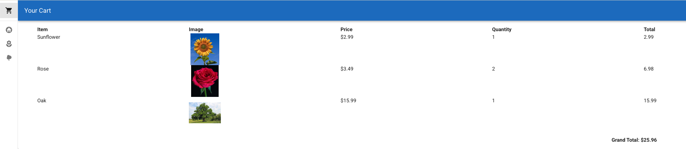
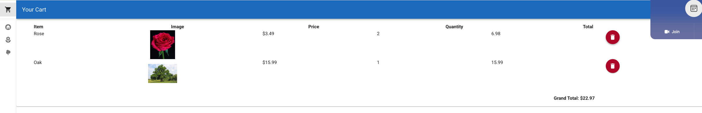

# Lab 1: Front-end

The goal of this lab exercise is to practice what you've learned about Vue.

## Prerequisites

1. If you haven't done so, go through [Local Development Setup](../local-dev-setup.md)
2. Create a new branch and name it `lab-1/<your-group-name>/cart-page`​. In VS Code, you can do this by opening a Git Bash terminal and running:
   ```bash
   git checkout -b lab-1/<your-group-name>/cart-page
   ```

## Objective: Add a new page to the website for showing the user's cart.

It should:

1. Display all of the items including an item's name, image, price (discounted price if applicable), and quantity.
2. Display the total for each line item
3. Display the grand total at the bottom of the list
4. Have a button that when clicked, will remove the item from the cart

### Milestone 1. Create the new page

Copy the contents of `cart.vue` in the `labs/lab-1/` subfolder and fill out the "TODO" items

### Milestone 2. "My Cart" button should redirect to the cart page when clicked

Hint: You need to modify the `App.vue` file

### Milestone 3. Test your changes

1. Add the following items to your cart:

   - Sunflower - Quantity 1
   - Rose - Quantity 2
   - Oak Tree - Quanitity 1

   Navigate to the cart page and it should look something like this:
   

2. Remove the Sunflower item from the cart.

   The cart should now look like this:
   

### Milestone 4. Create a pull request of your changes

1. Commit your changes to the branch

   ```
   git add .
   git commit -m "Add cart page and functionality"
   ```

2. Push the branch to the remote repository

   ```
   git push origin lab-1/<your-group-name>/cart-page
   ```

3. Create a pull request from your branch to the `main` branch of the repository
