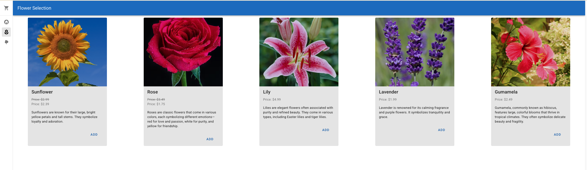
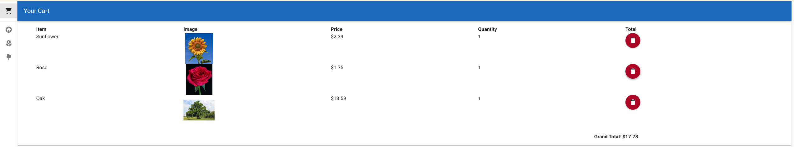

# Lab 2: Back-end

The goal of this lab exercise is to practice what you've learned about Postgres, Node.js, and Express.

## Objective: Add a feature to the website for product discounts.

It should:

1. Display the discount percentage for each product in the product page as well as the final price after applying the discount.
2. When a user adds a product to the cart, it should apply the discount if available.

### Milestone 1. Add a new table to the buildagarden database for storing discount data on products

1. Create the table
   Table Name: `discounts`
   Columns:

   - `id` (Primary Key, Auto Increment)
   - `product_id` (int)
   - `name` (String)
   - `discount_percentage` (Float)

     **Hint: You can use the queries in the [db_setup.md](../../docs/db-setup.md) file as a reference for creating the table.**

2. Insert the following data into the `discounts` table:

```sql
INSERT INTO discounts (product_id, name, discount_percentage) VALUES
(1, 'Spring Sale', 20),
(6, 'Oak Tree Discount', 15);
```

### Milestone 2. Add a new route to server.js for fetching discount data

**Hint: You can use the existing 'api/products' route in `server.js` as a reference for creating the new route.**

### Milestone 3. Add a new action in the Products store for fetching all discount data

1. Open the `stores/products.js` file and add a new action to call the 'api/discounts' endpoint to fetch all discount data.
   **HINT: Make sure to initialize `discounts` to an empty array in the state.**
2. Modify `App.vue` to call the new action when the app is mounted.

### Milestone 4. Modify `cart.vue` to display the price after discount of each product where applicable

### Milestone 5. Test your changes

1. Add a new discount for the Rose product with a 50% discount. Use this query:

```sql
INSERT INTO discounts (product_id, name, discount_percentage) VALUES
(2, 'Rose Discount', 50);
```

2. Go to the flowers page and confirm that the Rose product now shows a 50% discount and the final price after applying the discount.



3. Add the following products to the cart:

- Sunflower - Quantity 1
- Rose - Quantity 1
- Oak Tree - Quanitity 1

Navigate to the cart page and it should look something like this:

